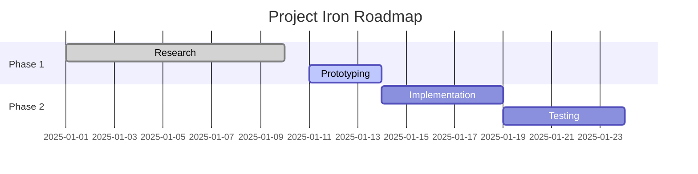

# Active Projects

## Yitfit
- Reassess involvement, roadmap and responsibilities

## Roadmap for Next Year
- Implement heavy learning into the roadmap
- Master agentic coding
- Map out 5-10 projects to build within matter of months
- Settle on 1-3 robust ideas to pursue long-term
- Interview for large companies
  - Purpose1: learning and testing the waters
  - Purpose2: understanding self-worth
  - Purpose3: finding options to settle long-term

## Project Iron Roadmap

